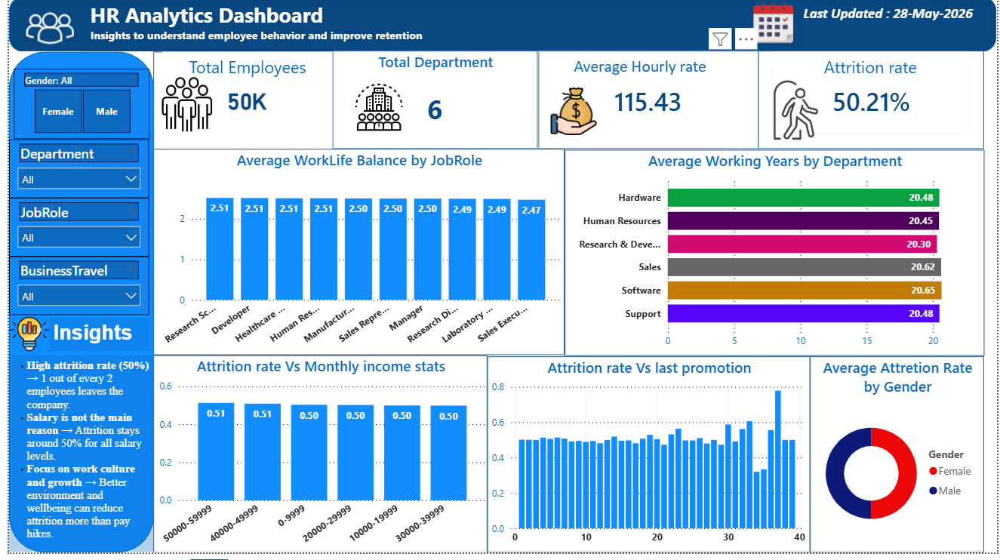

# HR Data Analysis Dashboard 📊

An end-to-end data analytics project using **SQL**, **Excel**, and **Power BI** to track, analyze, and optimize workforce metrics. This project transforms raw HR data into actionable organizational insights, focusing on employee attrition, demographics, and performance metrics.

## 🖼️ Dashboard Preview

## 🛠️ Project Overview & Workflow
Instead of just building a dashboard, this project demonstrates a complete data analyst workflow across three major tools:
1. **SQL:** wrote queries to extract key HR performance metrics.
2. **Excel:** Used to stage the data, perform preliminary analysis, and structure lookup tables.
3. **Power BI:** Designed an interactive executive dashboard using custom DAX and clean data modeling to visualize attrition trends.

### Key Business Objectives:
*   Identify primary drivers of employee attrition.
*   Analyze workforce demographics (gender, department, and role).
*   Evaluate job stability metrics like work-life balance and years between promotions.
*   Provide data-driven solutions to improve employee retention rates.

## 📈 Executive Key Performance Indicators (KPIs)
Based on the executive dashboard layout:
*   **Total Employees:** 50K
*   **Total Departments Tracked:** 6
*   **Average Hourly Rate:** $115.43
*   **Baseline Attrition Rate:** 50.21%

### 1. SQL (Data Extraction & Analysis)
*   Wrote complex SQL queries to filter and aggregate employee records.
*   Utilized `CASE WHEN` statements to bucket monthly income brackets and experience levels.

### 2. Microsoft Excel (Data Preparation)
*   Cleaned missing values and handled data anomalies.
*   Created quick pivot tables to cross-verify SQL query outputs before final visualization.

### 3. Power BI (Data Modeling & Visualization)
*   **Visualizations Engineered:**
    *   Average WorkLife Balance by JobRole* (Bar Chart)
    *   Average Working Years by Department* (Horizontal Bar Chart)
    *   Attrition Rate vs Monthly Income Stats* (Column Chart)
    *   Attrition Rate vs Last Promotion* (Clustered Column Trend)
    *   Average Attrition Rate by Gender* (Donut Chart)

## 💡 Key Insights & Recommendations
Direct observations drawn from the data analysis panel:
*   **Critical Attrition Levels:** The organization faces a high attrition rate of ~50.21%, indicating that approximately 1 out of every 2 employees is leaving the company.
*   **Compensation Assessment:** Analysis reveals that **salary is not the main driver of attrition**. The attrition rate stays consistently around 50% across all monthly income brackets (ranging from under $10K to over $50K). 
*   **Strategic Focus:** Because pay hikes alone will not make employee turnover, HR leadership must heavily focus on improving **work culture, environment, and long-term growth opportunities** to successfully drive retention.
  
